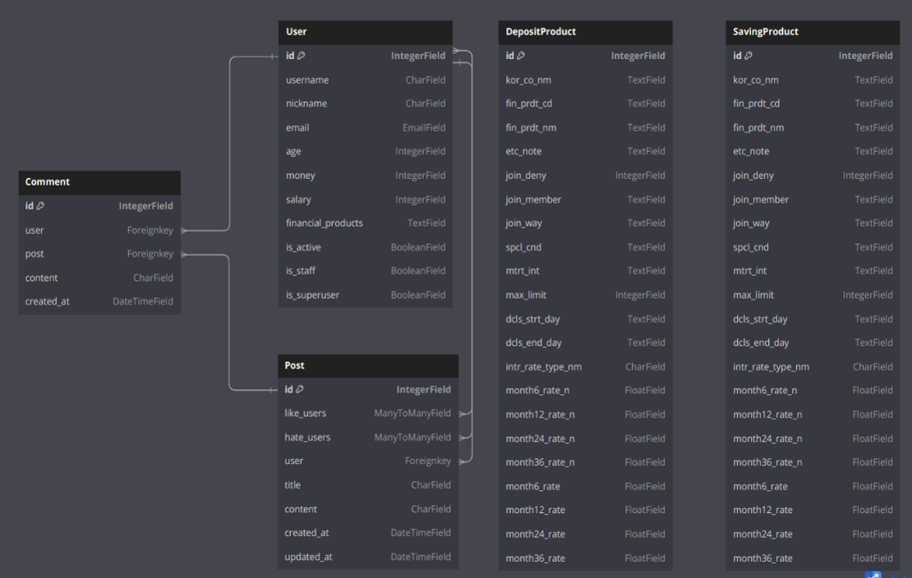
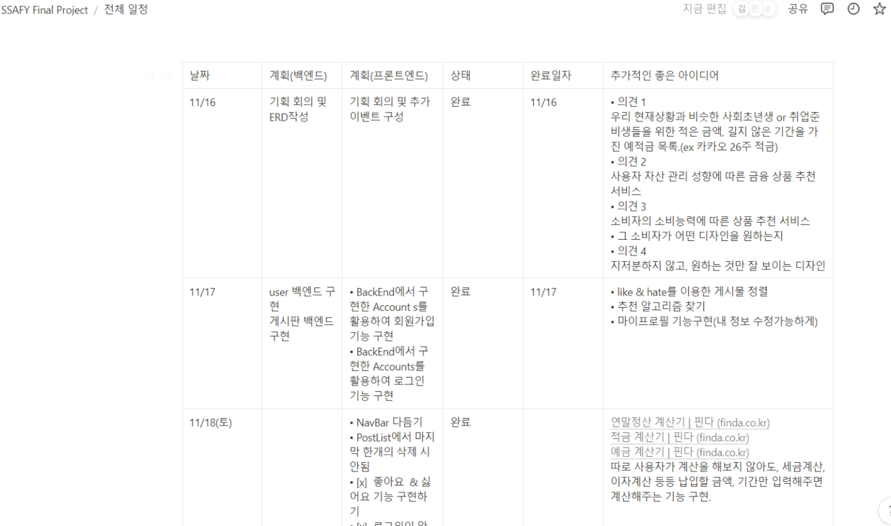
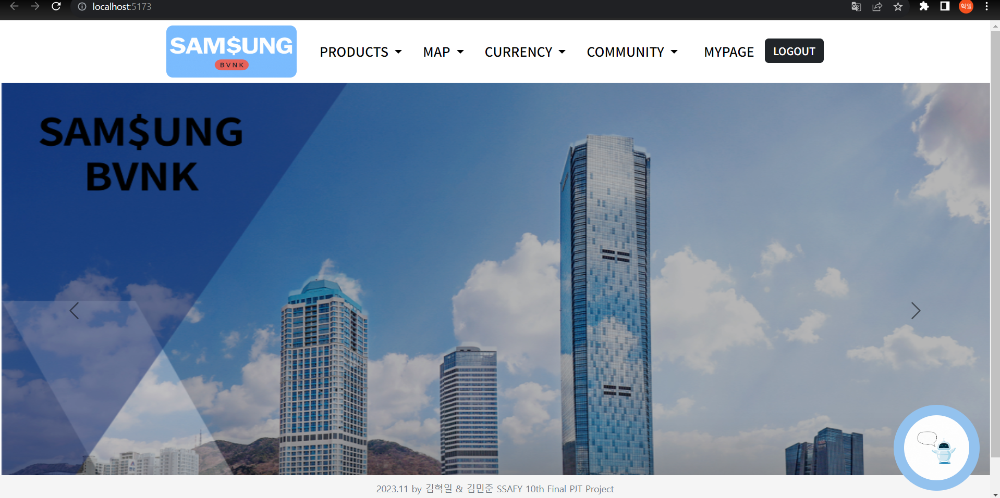
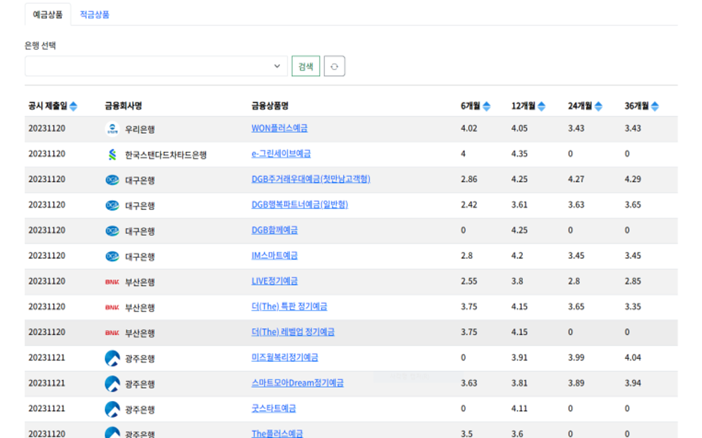
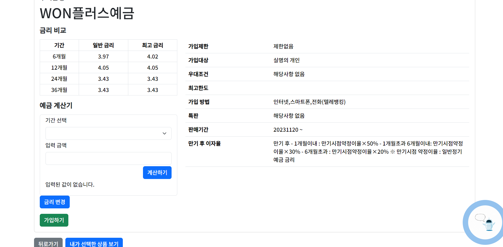
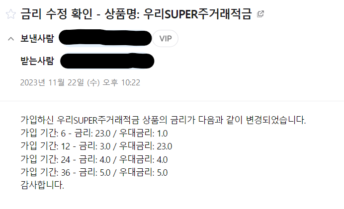
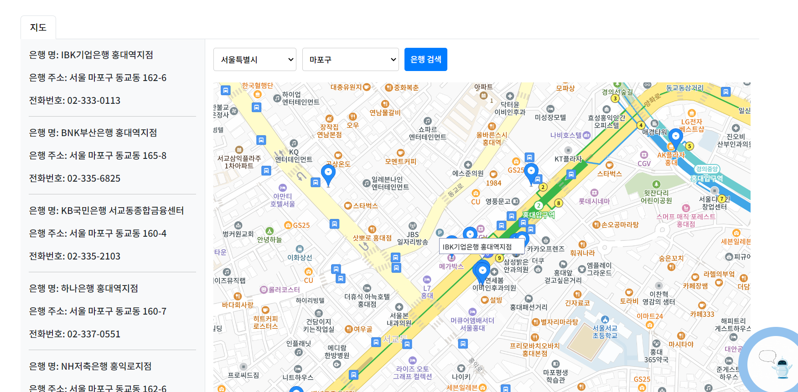
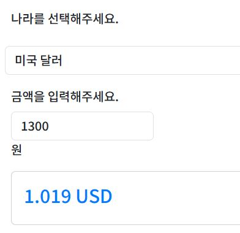
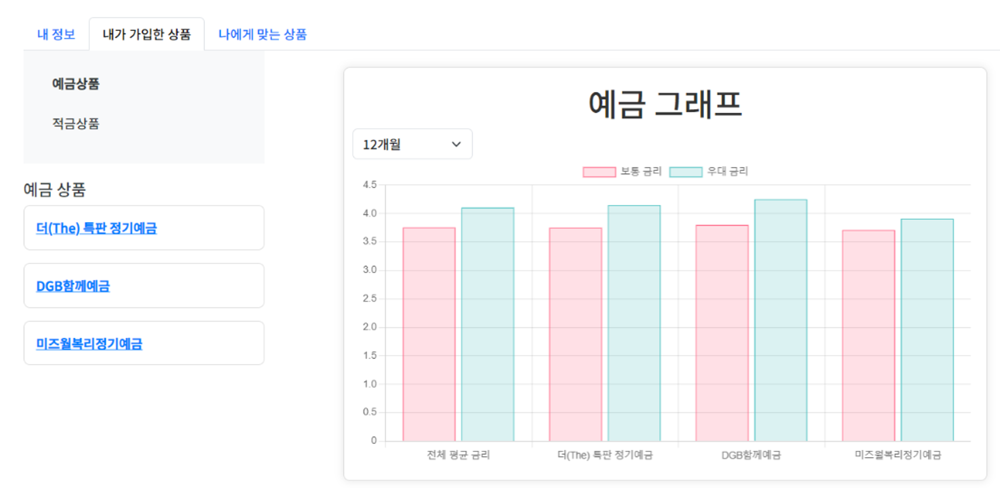
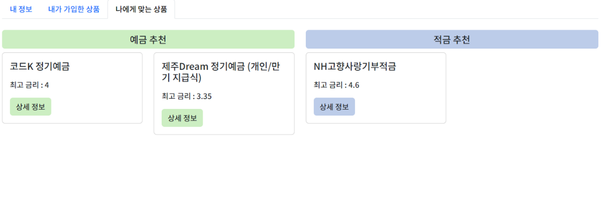

### SSAFY(삼성청년소프트웨어아카데미)로 부터 코드 반출 관련 허가가 승인되지 않아 상세 코드는 확인이 어렵습니다. 양해 부탁드립니다.

# SAM$UNG BVNK
## 프로젝트 개요
- 프로젝트 명 : SAM$UNG BVNK
- 팀장 : 김민준
- 팀원 : 김혁일
- 프로젝트 기간 : 23.11.15(수) ~ 23.11.24(금)
- 기술 : Python, Django, Node.js, Vue.js

## 프로젝트 소개
- 프로젝트 목표 : 금융 상품 비교 애플리케이션 서비스 완성

### 맡은 역할
- 백엔드 : Django Rest Framework를 활용
- 사이트 로고 제작 Canva 활용 
- 
- 메인 페이지, 예적금 상품리스트 CSS
- 챗 봇 구현 (Vue3)

### 프로젝트 주요 기능
- 금융감독원 API를 활용한 금융 상품 비교 및 가입 
- 한국 수출입 은행 환율정보 API의 실시간 환율정보를 활용한 환율 계산기
- Kakao Maps API를 활용해 원하는 위치의 은행 검색
- 협업 필터링을 활용해 사용자에게 알맞는 예적금상품 추천
- 소비자들을 위한 게시판 기능
- OpenAPI를 이용한 챗 봇

### Django에서 구현한 기능 
- user
  - 회원가입
  - 로그인
  - 유저 정보 보기, 수정,(GET,PUT)
  - 상품 추천(GET)
- 게시물
  - 전체 게시물 보기, 게시물 생성(GET,POST)
  - 게시물 디테일 보기, 게시물 삭제, 수정(GET,DELETE,PUT)
  - 게시물에 댓글 달기(POST)
  - 게시물 댓글 삭제(DELETE)
  - 게시물 좋아요 토글(POST)
  - 게시물 싫어요 토글(POST)
- 예적금
  - 예적금 정보 db에 저장 (GET)
  - 전체 예금 상품보기(GET)
  - 전체 적금 상품보기(GET)
  - 예금 디테일 보기, 관리자만 수정 email로 전달, 상품가입(GET,PUT,POST)
  - 적금 디테일 보기, 관리자만 수정 email로 전달, 상품가입(GET,PUT,POST)
- 환전(GET)

### ERD
- 

### 팀원과의 소통 [Notion](https://www.notion.so/c974bcb1466040d4aed1ef6e5fd86bcc?v=5d16d6261d0f42e6a1fcc39836608c62)
- 일정 부분 캡쳐
- 

### 구현
- 메인페이지
- 
- 회원가입
- 로그인

- 예적금 리스트
  - 월별 금리 순으로 정렬
  - 특정 은행 필터링 검색
  - 
  - 금융상품 상세페이지
    - 예적금계산기, 상품 가입, 관리자일 때 금리 변경,
    - 
    - 금리 변경 시 가입된 사용자들에게 변경 내용 메일 발송
    - 

- 근처 은행 검색
  - 원하는 지역 선택 후 해당 지역의 은행들 확인 가능, 검색된 은행들의 추가정보 확인 가능
  - 

- 환율 계산기
  - 

- 마이페이지
  - 사용자의 가입 정보 확인 및 수정
  - 가입한 상품들의 금리를 그래프로 비교
    - 
  - 상품 추천
    - 

- 사용자들을 위한 챗 봇
  - 어떤 페이지에서든 사용할 수 있도록 구현

## 어려웠던 점 및 해결
- 추천 알고리즘의 선정에서의 어려움
  - 상품을 추천할때 코사인 유사도를 활용해 회원들간의 유사도를 구하고 그것에 맞게 추천 상품을 결정하도록 만들었습니다. 하지만 협업필터링의 고질적인 문제인 유저의 데이터가 없을때에는 어떻게 해야할지 어려움을 겪었습니다. 이번 프로젝트에서는 더미 데이터를 많들어 해결했지만 다음에는 유저의 설문을 통해 필터링을 하여 상품을 추천하는 방식을 추가하고, 다른 추천 알고리즘 또한 추가적으로 넣어야 겠다는 생각을 했습니다.

- 팀원의 기술적 미숙함
  - 팀원이 프론트를 공부한지 얼마 되지 않아 프론트에서 구현이 미숙했습니다. 특히 상품과 1:N 관계인 옵션들을 기준으로 정렬을 하는 것을 어려워했습니다. 그래서 저는 어떻게 해야 팀원이 더 편하게 받아들일지 고민해보고 옵션들에서 필요한 데이터를 뽑아내 그냥 상품의 정보에 담았습니다. 그래서 ERD를 보시면 상품에 옵션 내용들이 전부 들어가 있습니다. 팀원이 어려워하는 부분이 있을때 이런식으로도 도움을 줄 수 있다는 것을 알게 되었고 시간이 남으면 적극적으로 프론트 구현에 도움을 주려고 노력했습니다. 그래서 CSS를 맡아서 구현하고 추가로 챗봇 또한 구현했습니다. 이러한 업무 분담으로 정해진 기간내에 보다 더 완성도 있는 결과물을 낸것 같습니다.

## 프로젝트를 마치며
- 약 10일간 주어진 시간은 생각보다 더 짧은 시간이었습니다. 처음 설계를 할땐 추가적으로 구현하고싶은 내용들이 더 많았지만 시간 상 그러지 못해 아쉬움이 많이 남았습니다. 하지만 주어진 기간동안 필요한 기능들을 오류없이 구현했다는 사실은 다음 프로젝트를 하는데 있어서 자신감과 흥미를 줄 것 같습니다. 
- 백에서 구현했다고 끝이 아니었습니다. 프론트에서의 구현 또한 생각보다 오래걸렸으며 프론트를 구현하는데 필요한 추가적인 데이터를 보내주기 위해 여러번의 코드 수정이 필요했습니다. 따라서 처음 설계 단계에서 더욱 꼼꼼한 설계가 필요함을 알게되었습니다.
